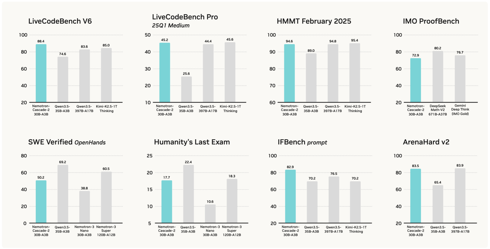

# Nemotron-Cascade-2-30B-A3B

<p align="center">

[](https://arxiv.org/abs/2603.19220)
[](https://huggingface.co/datasets/nvidia/Nemotron-Cascade-2-SFT-Data)
[](https://huggingface.co/datasets/nvidia/Nemotron-Cascade-2-RL-data)
[](https://huggingface.co/collections/nvidia/nemotron-cascade-2)
</p>




## Introduction
We're excited to introduce [Nemotron-Cascade-2-30B-A3B](https://huggingface.co/nvidia/Nemotron-Cascade-2-30B-A3B), an open 30B MoE model with 3B activated parameters that delivers strong reasoning and agentic capabilities. It is post-trained from the [Nemotron-3-Nano-30B-A3B-Base](https://huggingface.co/nvidia/NVIDIA-Nemotron-3-Nano-30B-A3B-Base-BF16). Nemotron-Cascade-2-30B-A3B achieves ***gold medal*** performance in both the 2025 International Mathematical Olympiad (IMO) and the International Olympiad in Informatics (IOI). It operates in both **thinking** and **instruct** (non-thinking) modes.


## Benchmark Results

<table style="width: 100%; border-collapse: collapse; font-family: sans-serif;">
  <thead>
    <tr style="color: #76B900; text-align: center;">
      <th style="padding: 8px; color: #76B900; text-align: left;">Benchmark</th>
      <th style="padding: 8px; color: #76B900; text-align: center">Nemotron-3-Nano-30B-A3B</th>
      <th style="padding: 8px; color: #76B900; text-align: center">Nemotron-3-Super-120B-A12B</th>
      <th style="padding: 8px; color: #76B900; text-align: center">Qwen3.5-35B-A3B</th>
      <th style="padding: 8px; color: #76B900; text-align: center">Nemotron-Cascade-2-30B-A3B</th>
    </tr>
  </thead>
  <tbody style="text-align: center;">
    <tr style="text-align: left; font-weight: bold;">
      <td colspan="5" style="padding: 8px; color: #76B900">Math</td>
    </tr>
    <tr>
      <td style="text-align: left; padding: 4px 8px;">IMO 2025</td>
      <td>-</td><td>-</td><td>-</td><td>🏅 <b>35 pts</b></td>
    </tr>
    <tr>
      <td style="text-align: left; padding: 4px 8px;">IMO AnswerBench</td>
      <td>70.4‡</td><td>77.2‡</td><td>74.8‡</td><td>79.3</td>
    </tr>
    <tr>
      <td style="text-align: left; padding: 4px 8px;">IMO ProofBench</td>
      <td>-</td><td>-</td><td>-</td><td>72.9</td>
    </tr>
    <tr>
      <td style="text-align: left; padding: 4px 8px;">AIME 2025</td>
      <td>89.1</td><td>90.2</td><td>91.9‡</td><td>92.4 (98.6)†</td>
    </tr>
    <tr>
      <td style="text-align: left; padding: 4px 8px;">AIME 2026</td>
      <td>89.9‡</td><td>89.8‡</td><td>91.1‡</td><td>90.9 (95.0)†</td>
    </tr>
    <tr>
      <td style="text-align: left; padding: 4px 8px;">HMMT Feb25</td>
      <td>84.6‡</td><td>93.7</td><td>89.0</td><td>94.6</td>
    </tr>
    <tr style="text-align: left; font-weight: bold;">
      <td colspan="5" style="padding: 8px; color: #76B900">Code Reasoning</td>
    </tr>
    <tr>
      <td style="text-align: left; padding: 4px 8px;">IOI 2025</td>
      <td>-</td><td>-</td><td>348.6‡</td><td>🏅 <b>439.3</b></td>
    </tr>
    <tr>
      <td style="text-align: left; padding: 4px 8px;">ICPC World Finals 2025</td>
      <td>-</td><td>-</td><td>-</td><td>🏅 <b>10/12</b></td>
    </tr>
    <tr>
      <td style="text-align: left; padding: 4px 8px;">LiveCodeBench v6 (2408-2505)</td>
      <td>68.3</td><td>78.7</td><td>74.6</td><td>87.2 (88.4)†</td>
    </tr>
    <tr>
      <td style="text-align: left; padding: 4px 8px;">LiveCodeBenchPro 25Q2 (Easy)</td>
      <td>54.5‡</td><td>81.7‡</td><td>81.1‡</td><td>87.0 (89.3)†</td>
    </tr>
    <tr>
      <td style="text-align: left; padding: 4px 8px;">LiveCodeBenchPro 25Q2 (Med)</td>
      <td>3.50‡</td><td>23.2‡</td><td>17.8‡</td><td>27.6 (36.8)†</td>
    </tr>
    <tr>
      <td style="text-align: left; padding: 4px 8px;">SciCode</td>
      <td>33.3</td><td>42.1</td><td>38.0</td><td>36.4</td>
    </tr>
    <tr style="text-align: left; font-weight: bold;">
      <td colspan="5" style="padding: 8px; color: #76B900">Knowledge & STEM</td>
    </tr>
    <tr>
      <td style="text-align: left; padding: 4px 8px;">MMLU-Redux</td>
      <td>-</td><td>-</td><td>93.3</td><td>86.3</td>
    </tr>
    <tr>
      <td style="text-align: left; padding: 4px 8px;">MMLU-Pro</td>
      <td>78.3</td><td>83.7</td><td>85.3</td><td>79.8</td>
    </tr>
    <tr>
      <td style="text-align: left; padding: 4px 8px;">GPQA-Diamond</td>
      <td>73.0</td><td>79.2</td><td>84.2</td><td>76.1</td>
    </tr>
    <tr>
      <td style="text-align: left; padding: 4px 8px;">HLE (no tool)</td>
      <td>10.6</td><td>18.3</td><td>22.4</td><td>17.7</td>
    </tr>
    <tr style="text-align: left; font-weight: bold;">
      <td colspan="5" style="padding: 8px; color: #76B900">Alignment & Instruction Following</td>
    </tr>
    <tr>
      <td style="text-align: left; padding: 4px 8px;">ArenaHard v2 (Avg.)</td>
      <td>67.7</td><td>-</td><td>65.4‡</td><td>83.5</td>
    </tr>
    <tr>
      <td style="text-align: left; padding: 4px 8px;">&nbsp;&nbsp;– Hard Prompt</td>
      <td>72.1</td><td>73.9</td><td>64.5‡</td><td>88.2</td>
    </tr>
    <tr>
      <td style="text-align: left; padding: 4px 8px;">&nbsp;&nbsp;– Creative Writing</td>
      <td>63.2</td><td>-</td><td>66.3‡</td><td>78.7</td>
    </tr>
    <tr>
      <td style="text-align: left; padding: 4px 8px;">IFBench (prompt)</td>
      <td>71.5</td><td>72.6</td><td>70.2</td><td>82.9</td>
    </tr>
    <tr>
      <td style="text-align: left; padding: 4px 8px;">Scale AI Multi-Challenge</td>
      <td>38.5</td><td>55.2</td><td>60.0</td><td>45.3</td>
    </tr>
    <tr style="text-align: left; font-weight: bold;">
      <td colspan="5" style="padding: 8px; color: #76B900">Long Context & Context Learning</td>
    </tr>
    <tr>
      <td style="text-align: left; padding: 4px 8px;">AA-LCR</td>
      <td>35.9</td><td>58.3</td><td>58.5</td><td>39.1</td>
    </tr>
    <tr>
      <td style="text-align: left; padding: 4px 8px;">LongBench v2</td>
      <td>39.6</td><td>-</td><td>59.0</td><td>40.3</td>
    </tr>
    <tr>
      <td style="text-align: left; padding: 4px 8px;">NIAH@1M (RULER Subset)</td>
      <td>94.8</td><td>98.3</td><td>94.3‡</td><td>99.0</td>
    </tr>
    <tr>
      <td style="text-align: left; padding: 4px 8px;">CL-Bench</td>
      <td>12.0‡</td><td>-</td><td>15.5‡</td><td>12.2</td>
    </tr>
    <tr style="text-align: left; font-weight: bold;">
      <td colspan="5" style="padding: 8px; color: #76B900">Agentic</td>
    </tr>
    <tr>
      <td style="text-align: left; padding: 4px 8px;">BFCL v4</td>
      <td>53.8</td><td>-</td><td>67.3</td><td>52.9</td>
    </tr>
    <tr>
      <td style="text-align: left; padding: 4px 8px;">𝜏²-Bench</td>
      <td>49.0</td><td>61.2</td><td>81.2</td><td>58.9</td>
    </tr>
    <tr>
      <td style="text-align: left; padding: 4px 8px;">Terminal Bench 2.0</td>
      <td>8.5</td><td>31.0</td><td>40.5</td><td>21.1</td>
    </tr>
    <tr>
      <td style="text-align: left; padding: 4px 8px;">SWE Verified (OpenHands)</td>
      <td>38.8</td><td>60.5</td><td>69.2</td><td>50.2</td>
    </tr>
    <tr style="text-align: left; font-weight: bold;">
      <td colspan="5" style="padding: 8px; color: #76B900">Multilingual</td>
    </tr>
    <tr>
      <td style="text-align: left; padding: 4px 8px;">MMLU-ProX</td>
      <td>59.5</td><td>79.4</td><td>81.0</td><td>72.5</td>
    </tr>
    <tr>
      <td style="text-align: left; padding: 4px 8px;">WMT24++ (en -> xx)</td>
      <td>86.2</td><td>86.7</td><td>87.6‡</td><td>84.1</td>
    </tr>
  </tbody>
</table>

<p style="margin-top:12px;font-size:11px;opacity:0.7">
* † Numbers in brackets refers to Tool-Integrated Reasoning (TIR) results.<br>
* ‡ For the baseline models, we use official numbers when available, otherwise evaluate them using the recommended settings.<br>
</p>


## Quick Start

- Nemotron-Cascade-2-30B-A3B follows the ChatML template and supports both thinking and instruct (non-thinking) modes. Reasoning content is enclosed within `<think>` and `</think>` tags. To activate the instruct (non-thinking) mode, we prepend `<think></think>` to the beginning of the assistant’s response. 

- Nemotron-Cascade-2-30B-A3B does not currently support OpenCode; it primarily supports OpenHands for agentic coding and SWE tasks.

- To reduce the context length in a multi-turn conversation, when the previous user turn involves thinking mode, only the final summary of the model's output will be added to the conversation history.

- Note that we do not define a separate `tool` role for tool responses; instead, we place them under the `user` role and warp them with `<tool_response>` and `</tool_response>`.

- We recommend setting the sampling parameters to temperature = 1.0 and top_p = 0.95.


### vLLM setup

Requires vLLM version >= 0.17.1. The following will create API endpoints at `http://localhost:8000/v1`:

- **Standard version**: Use the following command to create an API endpoint with a maximum context length of 262,144 tokens.

    ```shell
    vllm serve nvidia/Nemotron-Cascade-2-30B-A3B --port 8000 --tensor-parallel-size 1 --gpu-memory-utilization 0.9 --max-model-len 262144 --reasoning-parser nemotron_v3 --mamba-ssm-cache-dtype float32 --port 8000 --trust_remote_code
    ```

- **Tool Call**: Use the following command to enable tool support.

    ```shell
    vllm serve nvidia/Nemotron-Cascade-2-30B-A3B --port 8000 --tensor-parallel-size 1 --gpu-memory-utilization 0.9 --max-model-len 262144 --reasoning-parser nemotron_v3 --mamba-ssm-cache-dtype float32 --port 8000 --trust_remote_code --enable-auto-tool-choice --tool-call-parser qwen3_coder
    ```


### Chat Template

```python
from transformers import AutoTokenizer

model_name = 'nvidia/Nemotron-Cascade-2-30B-A3B'
tokenizer = AutoTokenizer.from_pretrained(model_name)

'''
single-turn example
'''
messages = [
  {"role": "system", "content": "You are a helpful and harmless assistant.\n\nYou are not allowed to use any tools"},
  {"role": "user", "content": "calculate 1+1?"}
]

# thinking mode
prompt_thinking = tokenizer.apply_chat_template(messages, tokenize=False, add_generation_prompt=True, enable_thinking=True)
# prompt_thinking = '<|im_start|>system\nYou are a helpful and harmless assistant.\n\nYou are not allowed to use any tools<|im_end|>\n<|im_start|>user\ncalculate 1+1?<|im_end|>\n<|im_start|>assistant\n<think>\n'

# instruct mode
prompt_instruct = tokenizer.apply_chat_template(messages, tokenize=False, add_generation_prompt=True, enable_thinking=False)
# prompt_instruct = '<|im_start|>system\nYou are a helpful and harmless assistant.\n\nYou are not allowed to use any tools<|im_end|>\n<|im_start|>user\ncalculate 1+1?<|im_end|>\n<|im_start|>assistant\n<think></think>'

'''
multi-turn example
'''
messages = [
    {"role": "system", "content": "You are a helpful and harmless assistant.\n\nYou are not allowed to use any tools"},
    {"role": "user", "content": "calculate 1+1?"},
    {"role": "assistant", "content": "<think>THINKING_CONTENT</think>\nTo calculate \\(1 + 1\\):\n\n1. **Identify the operation**: This is a basic addition problem involving two integers.\n2. **Perform the addition**:  \n   \\(1 + 1 = 2\\).\n\n**Result**: \\(\\boxed{2}\\)",},
    {"role": "user", "content": "what about 2+2"}
]

# thinking mode
prompt_thinking = tokenizer.apply_chat_template(messages, tokenize=False, add_generation_prompt=True, enable_thinking=True)
# prompt_thinking = '<|im_start|>system\nYou are a helpful and harmless assistant.\n\nYou are not allowed to use any tools<|im_end|>\n<|im_start|>user\ncalculate 1+1?<|im_end|>\n<|im_start|>assistant\n<think></think>\nTo calculate \\(1 + 1\\):\n\n1. **Identify the operation**: This is a basic addition problem involving two integers.\n2. **Perform the addition**:  \n   \\(1 + 1 = 2\\).\n\n**Result**: \\(\\boxed{2}\\)<|im_end|>\n<|im_start|>user\nwhat about 2+2<|im_end|>\n<|im_start|>assistant\n<think>\n'

# instruct mode
prompt_instruct = tokenizer.apply_chat_template(messages, tokenize=False, add_generation_prompt=True, enable_thinking=False)
# prompt_instruct = '<|im_start|>system\nYou are a helpful and harmless assistant.\n\nYou are not allowed to use any tools<|im_end|>\n<|im_start|>user\ncalculate 1+1?<|im_end|>\n<|im_start|>assistant\n<think></think>\nTo calculate \\(1 + 1\\):\n\n1. **Identify the operation**: This is a basic addition problem involving two integers.\n2. **Perform the addition**:  \n   \\(1 + 1 = 2\\).\n\n**Result**: \\(\\boxed{2}\\)<|im_end|>\n<|im_start|>user\nwhat about 2+2<|im_end|>\n<|im_start|>assistant\n<think></think>'
```

### Python Tool Use

```python
model_name = 'nvidia/Nemotron-Cascade-2-30B-A3B'
tokenizer = AutoTokenizer.from_pretrained(model_name)

SYSTEM_PROMPT = """# Tools

You have access to the following functions:

<tools>
<function>
<name>stateful_python_code_exec</name>
<description>Call this function to execute Python code in a stateful Jupyter notebook environment. Python will respond with the output of the execution or time out after 120.0 seconds.</description>
<parameters>
<parameter>
<name>code</name>
<type>string</type>
<description>Code to execute</description>
</parameter>
<required>["code"]</required>
</parameters>
</function>
</tools>

If you choose to call a function ONLY reply in the following format with NO suffix:

<tool_call>
<function=example_function_name>
<parameter=example_parameter_1>
value_1
</parameter>
<parameter=example_parameter_2>
This is the value for the second parameter
that can span
multiple lines
</parameter>
</function>
</tool_call>

<IMPORTANT>
Reminder:
- Function calls MUST follow the specified format: an inner <function=...></function> block must be nested within <tool_call></tool_call> XML tags
- Required parameters MUST be specified
- You may provide optional reasoning for your function call in natural language BEFORE the function call, but NOT after
- If there is no function call available, answer the question like normal with your current knowledge and do not tell the user about function calls
</IMPORTANT>"""

messages = [
  {"role": "system", "content": SYSTEM_PROMPT},
  {"role": "user", "content": "Solve the following math problem. Put your answer inside \\boxed{}.\n\nIn a school with 2008 students, each student is a member of certain committees. Each committee has at most 1004 members, and every two students are in at least one common committee. Determine the smallest possible number of committees in the school."}
]

prompt = tokenizer.apply_chat_template(messages, tokenize=False, add_generation_prompt=True, enable_thinking=True)
print(prompt)
```

### Agentic Usage

```python
model_name = 'nvidia/Nemotron-Cascade-2-30B-A3B'
tokenizer = AutoTokenizer.from_pretrained(model_name)

SYSTEM_PROMPT = """You are a customer service agent that helps the user.  The policy that determines how you should respond to requests from users is described below between the <policy> and </policy> tags.

In each turn you can either:
- Send a message to the user.
- Make a tool call.
You cannot do both at the same time.

<policy>
_NEED_TO_ADD_POLICY_HERE_
</policy>

Try to be helpful and always follow the policy.

# Tools

You have access to the following functions:

<tools>
<function>
<name>_NEED_TO_ADD_FUNCTION_NAME_1_</name>
<description>_FUNCTION_DESCRIPTION_</description>
<parameters>
<parameter>
<name>_NEED_TO_ADD_PARAMETER_NAME_1_</name>
<type>_PARAMETER_TYPE_</type>
<description>_PARAMETER_DESCRIPTION_</description>
<title>_PARAMETER_TITLE_</title>
</parameter>
<parameter>
<name>_NEED_TO_ADD_PARAMETER_NAME_2_</name>
<type>_PARAMETER_TYPE_</type>
<description>_PARAMETER_DESCRIPTION_</description>
<title>_PARAMETER_TITLE_</title>
</parameter>
...... (_MORE_PARAMETERS_TO_ADD_)
<parameters>
</function>
...... (_MORE_FUNCTIONS_TO_ADD_)
</tools>
"""

messages = [
  {"role": "system", "content": SYSTEM_PROMPT},
  {"role": "user", "content": "Hello, I'm calling regarding my upcoming stay at your hotel. My guest ID is G90920 and booking ID is B11246 for a Deluxe room on June 5th. I'm traveling with three 6-month-old triplets and need to request three infant cribs for our room. It's currently 30 hours before check-in—could you please confirm if this is feasible and if there are quiet room options available for families with infants?"}
]

prompt = tokenizer.apply_chat_template(messages, tokenize=False, add_generation_prompt=True, enable_thinking=True)
print(prompt)
```

## Release Date
Mar 19, 2026


## License
Your use of this model is governed by the [NVIDIA Open Model License](https://www.nvidia.com/en-us/agreements/enterprise-software/nvidia-open-model-license/).


## Citation
```
@article{Nemotron_Cascade_2,
  title={Nemotron-Cascade 2: Post-Training LLMs with Cascade RL and Multi-Domain On-Policy Distillation},
  author={Yang, Zhuolin and Liu, Zihan and Chen, Yang and Dai, Wenliang and Wang, Boxin and Lin, Sheng-Chieh and Lee, Chankyu and Chen, Yangyi and Jiang, Dongfu and He, Jiafan and Pi, Renjie and Lam, Grace and Lee, Nayeon and Bukharin, Alexander and Shoeybi, Mohammad and Catanzaro, Bryan and Ping, Wei},
  year={2026}
}
```
